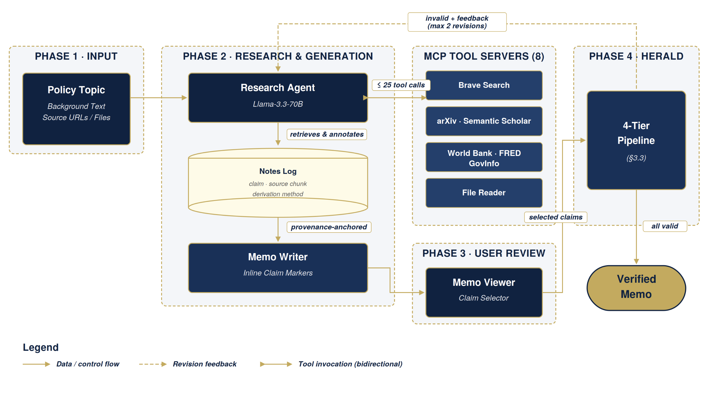
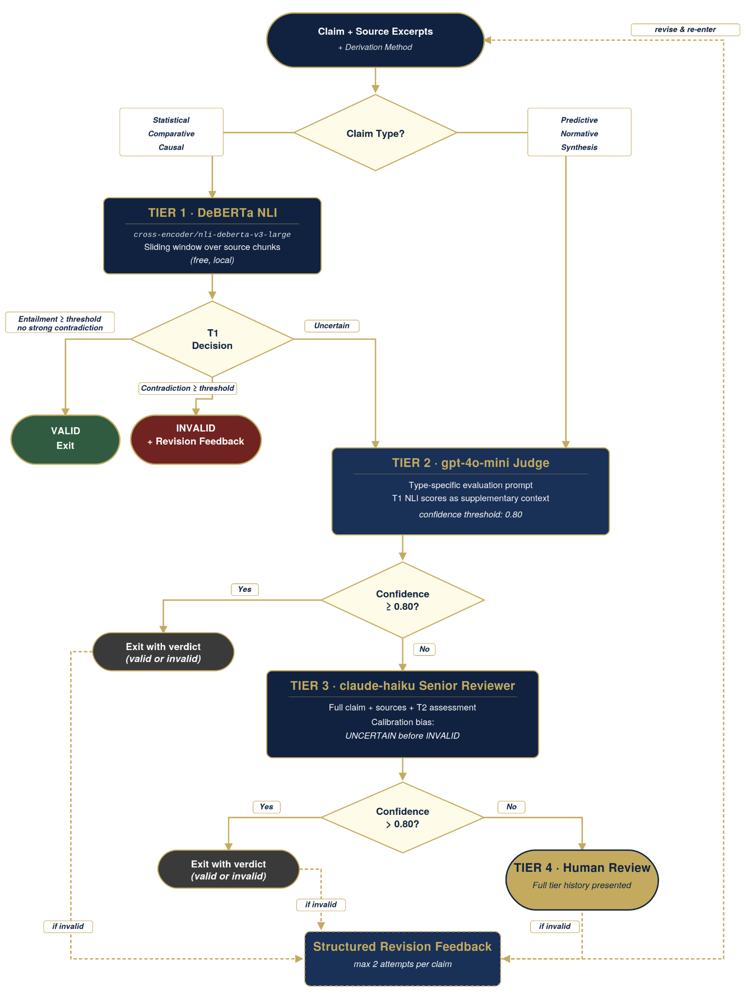

# HERALD: Hierarchical Evidence Review and Automated Legitimacy Detection for AI-Generated Policy Documents

An AI-powered research and writing system that produces structured policy memos with full claim-to-source provenance, then validates every factual claim through **HERALD** — a four-tier escalation pipeline for automated claim evaluation.

**Authors:** Viviana Luccioli, Manav Arora, Ani Meliksetyan, Ruijie Xu
**Course:** Applications of Generative AI for Developers — Spring 2026 Final Project

## Abstract

AI agents capable of conducting multi-step research and producing long-form analytical documents are increasingly deployed in knowledge-intensive domains. Yet, their susceptibility to hallucination and source misrepresentation poses serious risks in high-stakes contexts such as policy analysis. We present **HERALD** (Hierarchical Evidence Review and Automated Legitimacy Detection), a multi-tier claim verification pipeline designed specifically for AI-generated policy memos. HERALD routes claims through up to four evaluation tiers: 1) a local NLI classifier, 2) a GPT-4o-mini LLM judge with claim-type-specific prompts, 3) a Claude Haiku Senior Reviewer, and 4) human review, exiting as soon as a confident verdict is reached. Central to the design is a six-type claim taxonomy (statistical, causal, comparative, predictive, normative, synthesis) that determines both the entry tier and the evaluation criteria applied to each claim, and a structured notes log that captures source provenance during research rather than recovering it post-hoc. We evaluate HERALD on four benchmark sets totalling 206 claims and compare it against single-call Haiku and Mini baselines. On the held-out benchmark, HERALD achieves 96% accuracy, matching the Haiku baseline at 23% of its cost. Across all sets, HERALD resolves 90–96% of claims without human review. We analyse failure modes by claim type and derivation method, identify the primary cost driver (spurious T3 escalation caused by a prompt framing error), and demonstrate that a targeted fix reduces costs by 86% with no loss of accuracy.

## System Architecture



## What It Does

1. **Research** — given a policy topic and optional framing context, a tool-augmented agent queries arXiv, World Bank, FRED, GovInfo, Semantic Scholar, and the web to gather evidence
2. **Write** — the agent synthesizes its research into a professional policy memo, embedding inline citation markers (`[C-001]`, `[C-002]`, …) linked to a structured notes log
3. **Review** — the memo is rendered in a React UI with color-coded claim markers; clicking any marker shows the full provenance trail (source, excerpt, derivation method)
4. **Evaluate** — selected claims are routed through HERALD, which escalates from a local NLI model → LLM-as-judge → multi-agent debate → human review until a confident verdict is reached
5. **Revise** — invalid or weak claims are passed back to the agent with structured feedback for up to two revision attempts

## HERALD Evaluation Pipeline

HERALD (Hierarchical Evidence Review and Automated Legitimacy Detection) routes each claim based on its type:



| Claim Type                       | Starting Tier            | Rationale                                                     |
| -------------------------------- | ------------------------ | ------------------------------------------------------------- |
| Statistical, Comparative         | Tier 1 (NLI)             | Entailment models handle these well                           |
| Causal                           | Tier 1 (lower threshold) | NLI catches misquotes; escalates for correlation-as-causation |
| Predictive, Normative, Synthesis | Tier 2 (LLM judge)       | NLI adds no value for forward-looking or prescriptive claims  |

**Tier 1** — DeBERTa-v3-large-mnli NLI model (local, free). Outputs entailment / neutral / contradiction with confidence scores.

**Tier 2** — Claude Sonnet or GPT-4o as judge. Evaluates accuracy, completeness, causal validity, and comparison fairness.

**Tier 3** — Multi-agent debate: Domain Expert, Methodologist, and Skeptic personas each evaluate independently; a Judge agent synthesizes the three verdicts.

**Tier 4** — Human review queue. Presents the claim, all source chunks, and prior tier outputs for a manual final call.

## Tech Stack

| Layer              | Technology                                     |
| ------------------ | ---------------------------------------------- |
| Frontend           | Next.js 16, React 19, TypeScript, Tailwind CSS |
| Research agent     | Groq (Llama 3.3 70B) with OpenAI fallback      |
| HERALD Tier 2/3    | OpenAI GPT-4o / Claude Sonnet                  |
| Python backend     | FastAPI, SQLAlchemy, asyncpg                   |
| Tier 1 NLI         | HuggingFace Transformers / ONNX Runtime        |
| Observability      | Braintrust, OpenTelemetry                      |
| Package management | npm (frontend), uv (Python backend)            |

## Prerequisites

- Node.js 20+
- Python 3.11+
- [uv](https://docs.astral.sh/uv/getting-started/installation/) (`curl -LsSf https://astral.sh/uv/install.sh | sh`)
- PostgreSQL 15+ and Redis 7+ (optional — only needed for the Python backend / Tier 1 NLI)

## Setup

### 1. Clone and install

```bash
git clone https://github.com/gu-dsan6725/spring-2026-final-project-team_02.git
cd spring-2026-final-project-team_02
npm install
```

### 2. Configure environment variables

```bash
cp .env.example .env.local
```

Open `.env.local` and fill in at minimum:

```
GROQ_API_KEY=        # required — research agent (free tier at console.groq.com)
OPENAI_API_KEY=      # required — HERALD Tier 2/3 evaluation
GEMINI_API_KEY=      # required — web search grounding (free at aistudio.google.com)
```

Optional keys for additional data sources (FRED economic data, GovInfo congressional reports) and observability (Braintrust) are documented in `.env.example`.

### 3. Run the frontend

```bash
npm run dev
```

Open [http://localhost:3000](http://localhost:3000).

### 4. (Optional) Run the Python backend for Tier 1 NLI

The Python backend enables local NLI inference. Without it, HERALD silently skips Tier 1 and starts at Tier 2.

```bash
cd backend
uv sync
uv run uvicorn policy_memo_agent.api.app:create_app --factory --reload --port 8000
```

The DeBERTa NLI model (~900 MB) downloads automatically on first run.

## Usage

1. Navigate to [http://localhost:3000](http://localhost:3000)
2. Enter a policy topic, optional background context, and any known source URLs
3. Click **Generate Memo** — the agent runs its research loop (up to 25 tool calls) and writes the memo
4. Review the rendered memo; click any `[C-XXX]` marker to inspect the provenance
5. Select claims for HERALD evaluation (high-risk claims are pre-selected)
6. Click **Evaluate** — HERALD runs and shows tier-by-tier results with verdicts and suggested revisions

### Running the pipeline from the command line

```bash
# Full pipeline (research → memo → HERALD evaluation)
npm run pipeline

# Dry run (research and memo only, skips HERALD)
npm run pipeline:dry
```

## Development

```bash
# Run all checks (TypeScript + Python)
npm run verify

# Frontend only
npm run typecheck
npm run lint
npm run test

# Python backend only
cd backend
uv run ruff check .
uv run mypy src/
uv run pytest -m "not integration"

# HERALD tests
npm run test:herald

# Agent tests
npm run test:agent
```

Pre-commit hooks (Husky + lint-staged) run TypeScript and Python checks automatically on staged files. HERALD tests run whenever `src/herald/` files are modified.

## Project Structure

```
.
├── src/
│   ├── agent/          # Research loop, prompt assembly, claim extraction, budget control
│   ├── herald/         # HERALD router, Tier 1–4 evaluation, revision feedback loop
│   ├── mcp/            # Tool servers: arXiv, World Bank, FRED, GovInfo, Semantic Scholar, web
│   ├── observability/  # Braintrust and OpenTelemetry integration
│   ├── types/          # Shared TypeScript types (claims, herald, memo, agent)
│   └── ui/             # Next.js app, React components, hooks
├── backend/
│   └── src/policy_memo_agent/
│       ├── api/        # FastAPI routes (memos, herald, health, WebSocket)
│       ├── herald/     # Python HERALD implementation (Tier 1 NLI, prompts)
│       ├── models/     # Pydantic models mirroring TypeScript types
│       └── db/         # SQLAlchemy models and repositories
├── tests/              # TypeScript tests (agent, herald, mcp, integration)
└── scripts/            # Pipeline runner, benchmarking, seed data
```

## Architecture

See [CLAUDE.md](CLAUDE.md) for the full architecture specification, including the claim taxonomy (6 types), HERALD routing table, notes log schema, and all design decisions.

## License

ISC
