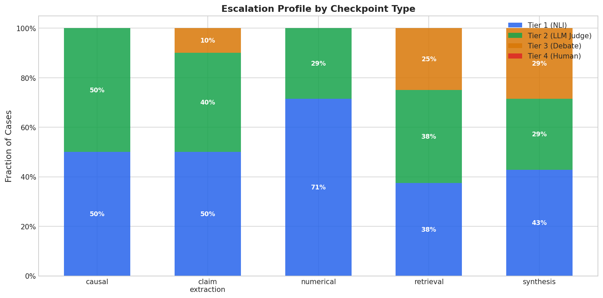
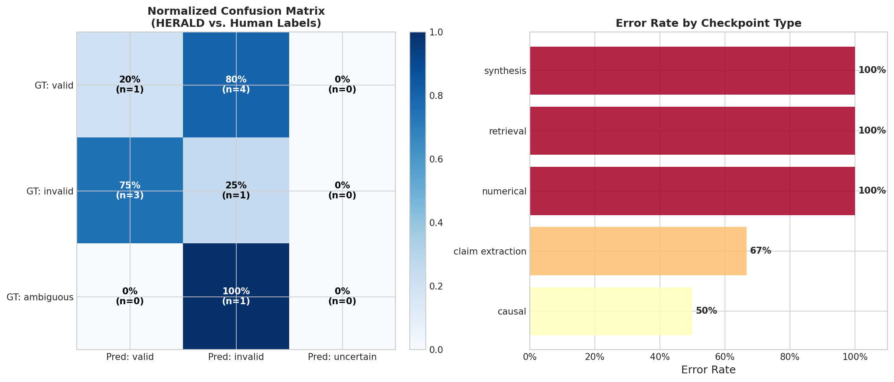

# HERALD: Hierarchical Escalation for Reliable Agentic LLM Decision-making

A four-tier validation framework for LLM outputs in agentic pipelines.

## Pipeline Overview

```
Checkpoint Output → Tier 1 (NLI) → Tier 2 (LLM Judge) → Tier 3 (Debate) → Tier 4 (Human)
```

| Tier | Method | Cost |
|------|--------|------|
| 1 | DeBERTa-v3-large NLI classifier (local) | Free |
| 2 | LLM Judge via Groq (Llama 3.3 70B) | Free |
| 3 | Multi-agent debate via Groq | Free |
| 4 | Human review with structured packet | Your time |

**LLM Provider:** [Groq](https://console.groq.com) (free tier, OpenAI-compatible API)  
**Package Manager:** [uv](https://docs.astral.sh/uv/)  
**Domain:** Economics research

---

## File-by-File Implementation Map

### Core Pipeline
- **src/herald/pipeline/run.py**: Main pipeline entry point. Runs all tiers on input data.
- **src/herald/pipeline/escalation.py**: Orchestrates escalation logic between tiers.
- **src/herald/core/types.py**: Shared data types and structures.
- **src/herald/core/config.py**: Loads and manages config files (thresholds, etc).

### Tiers
- **src/herald/tier1/classifier.py**: DeBERTa NLI classifier for initial validity screening.
- **src/herald/tier2/judge.py**: Groq LLM judge for ambiguous/uncertain cases.
- **src/herald/tier3/debate.py**: Multi-agent debate for high-stakes or unclear cases.
- **src/herald/tier4/human_review.py**: Human review packet generator for final escalation.


### Notebooks (Analysis, Validation, and Utilities)
- **notebooks/api_budget.py**: Estimates API usage and cost for Tiers 2 and 3, using test set size and escalation rates. Tracks Groq usage and provides cost projections.
- **notebooks/baseline_comparison.py**: Compares HERALD against four baselines (LLM-as-judge, NLI-only, 3-tier, random escalation). Produces baseline_comparison.json for tradeoff analysis.
- **notebooks/calibration_analysis.py**: Computes calibration metrics (ECE, reliability diagrams) and correlates HERALD uncertainty with human disagreement. Outputs calibration plots and summary tables.
- **notebooks/generate_plots.py**: Generates all key deliverable plots (cost-accuracy tradeoff, escalation profile, baseline comparison, confusion analysis). Saves PNGs to results/plots/.
- **notebooks/phase_gates.py**: Checks explicit GO/NO-GO gates for each project phase (NLI separation, Tier 1 accuracy, system vs baseline). Ensures readiness before advancing phases.
- **notebooks/feasibility_check.py**: Runs DeBERTa NLI on test set, prints entailment/contradiction/neutral scores, and validates separation of valid/invalid/ambiguous cases.
- **notebooks/generate_weak_labels.py**: Uses Groq to generate weak labels for claim/source pairs, enabling fine-tuning of Tier 1. Spot-checks label quality against human judgment.
- **notebooks/test_tier2.py**: Runs Tier 2 (LLM Judge) in isolation on all test cases, reporting verdicts and reasoning for threshold tuning.
- **notebooks/test_tier3.py**: Runs Tier 3 (Multi-Agent Debate) in isolation, useful for inspecting debate quality on hard/ambiguous cases.
- **notebooks/threshold_sweep.py**: Sweeps Tier 1 and Tier 2 thresholds to generate cost-accuracy tradeoff data. Saves results to threshold_sweep.json for plotting.


### Data & Configs
- **data/test_sets/feasibility_samples.json**: Main test set for pipeline evaluation.
- **data/test_sets/sample_cases.json**: Starter test cases.
- **data/weak_labels/weak_labeled.json**: Weak labels for fine-tuning.
- **data/weak_labels/unlabeled_pairs.json**: Unlabeled claim/source pairs.
- **configs/default.yaml**: Default threshold and config values.

### Results
- **results/run_results.json**: Full pipeline run results (verdicts, confidence, escalation tier).
- **results/feasibility_results.json**: Feasibility check results.
- **results/api_budget.json**: API usage and cost tracking.

### Documentation & Templates
- **README.md**: Project overview, setup, and instructions.
- **WALKTHROUGH.md**: Step-by-step guide for building, running, and expanding the pipeline.
- **docs/validity_definitions.md**: Detailed definitions for validity at each checkpoint type.

### Tests
- **tests/**: Unit tests for all major modules (classifier, judge, debate, pipeline, config, evaluation, types).
- **tests/conftest.py**: Ensures src/ is importable for tests.

---

## To-Do List & Next Steps

### 1. Data Expansion & Annotation
- Expand `data/test_sets/feasibility_samples.json` to 150–250 cases, covering all checkpoint types.
- Ensure at least 2 annotators label each case independently; resolve disagreements and refine definitions.
- Generate additional weak labels using Groq (see `notebooks/generate_weak_labels.py`).

### 2. Model Fine-Tuning & Validation
- Fine-tune DeBERTa NLI on expanded/weak-labeled data.
- Validate separation of valid/invalid/ambiguous cases (see `notebooks/feasibility_check.py` and `results/feasibility_results.json`).

### 3. Pipeline Robustness
- Review and adjust escalation thresholds in `configs/default.yaml` based on run results.
- Add more granular logging and error handling for API calls (Groq rate limits observed in sample run).
- Consider caching or batching Groq requests to avoid 429 errors.

### 4. Human Review Protocol
- Finalize and document human review packet format in `src/herald/tier4/human_review.py`.
- Create a protocol/checklist for human reviewers (see `docs/validity_definitions.md`).

### 5. Evaluation & Analysis
- Run full evaluation using `src/herald/evaluation/evaluate.py` and analysis notebooks.
- Generate tradeoff curves, calibration plots, and escalation statistics.

### 6. Documentation & Usability
- Update `README.md` and `WALKTHROUGH.md` with any new steps, troubleshooting, and best practices.
- Add example outputs and usage instructions for each notebook/script.

### 7. Testing & CI
- Ensure all tests in `tests/` pass in the target environment.
- Expand test coverage for edge cases and error handling.
- Monitor CI status and resolve any environment-specific issues.

---

## Adjustments Needed Based on Sample Run Results

- **API Rate Limits:** Groq API returned 429 errors during batch runs. Increase retry backoff, add request batching, and monitor usage.
- **Tier Resolution:** Most cases resolved at Tier 1 or 2; only a few escalated to Tier 3. Review threshold settings to ensure proper escalation for ambiguous cases.
- **Confidence Calibration:** Some valid/invalid cases have borderline confidence scores. Consider fine-tuning or adjusting thresholds for better separation.
- **Human Review:** No cases escalated to Tier 4 in the sample run. Test human review escalation with edge cases.
- **Logging:** Improve logging for verdicts, confidence scores, and escalation paths for easier debugging and analysis.
- **Data Diversity:** Expand test set to include more diverse and challenging cases, especially for synthesis, numerical, and causal checkpoints.

---


## Plots & Feasibility Analysis

The notebook `notebooks/generate_plots.py` generates four key deliverable plots:
	1. Cost-accuracy tradeoff curve (from threshold sweep results)
	2. Escalation profile by checkpoint type (from pipeline run results)
	3. 3-tier vs 4-tier comparison (from baseline comparison results)
	4. Confusion analysis — where HERALD disagrees with humans

**Groq API Rate Limit Issue:**
Due to Groq API token/day limits, you may encounter error 429 ("rate limit reached for model ... on tokens per day"). If this happens, wait for your quota to reset (usually 24 hours) and re-run the plotting commands. This may interrupt threshold sweeps and baseline comparisons, preventing generation of all plots in a single session.

**Available Plots from Sample Run:**

### Escalation Profile by Checkpoint Type

Shows how cases are resolved/escalated at each tier for the sample data.

### Confusion Analysis

Highlights where HERALD disagrees with human ground truth labels.

**Sample run output:**
```
============================================================
HERALD — Generating Analysis Plots
Output: results/plots
============================================================

SKIP Plot 1: results/threshold_sweep.json not found. Run notebooks/threshold_sweep.py first.
Plot 2: Escalation Profile by Checkpoint Type
Saved: results/plots/plot2_escalation_profile.png
Plot 4: Confusion Analysis
Saved: results/plots/plot4_confusion_analysis.png
SKIP Plot 3: results/baseline_comparison.json not found. Run notebooks/baseline_comparison.py first.

============================================================
Plots saved to results/plots/
Files:
	plot2_escalation_profile.png
	plot4_confusion_analysis.png
```

To generate all plots, ensure you have run `notebooks/threshold_sweep.py` and `notebooks/baseline_comparison.py` to produce the required JSON files. If interrupted by rate limits, resume after quota resets.

**Feasibility check results:**
	- 40 samples processed
	- Model: cross-encoder/nli-deberta-v3-large
	- Valid cases: 17 (mean entailment: 0.68)
	- Invalid cases: 15 (mean entailment: 0.13)
	- Ambiguous cases: 8 (mean entailment: 0.12)
	- See [results/feasibility_results.json](results/feasibility_results.json) for details

---

## Setup

### Prerequisites
- Python 3.11+
- A free Groq API key from https://console.groq.com
- GPU recommended for Tier 1 (DeBERTa), but CPU works for small test sets

### Install uv (if you don't have it)
```bash
curl -LsSf https://astral.sh/uv/install.sh | sh
```

### Clone and setup
```bash
git clone <your-repo-url>
cd herald
uv sync
cp .env.example .env
# Edit .env and add your Groq API key
```

---
