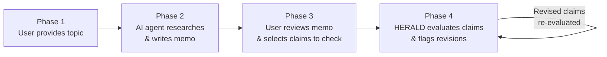

# Diagrams

## Diagram 1 — Simple Overview

```mermaid
flowchart LR
    A["Phase 1\nUser provides topic"] --> B["Phase 2\nAI agent researches\n& writes memo"]
    B --> C["Phase 3\nUser reviews memo\n& selects claims to check"]
    C --> D["Phase 4\nHERALD evaluates claims\n& flags revisions"]
    D -->|"Revised claims\nre-evaluated"| D
```
