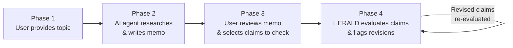
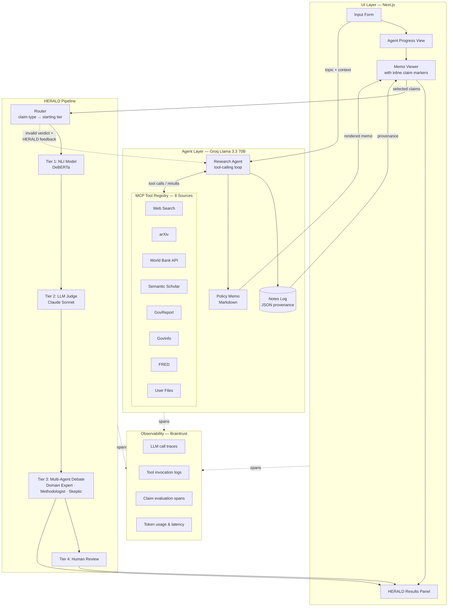
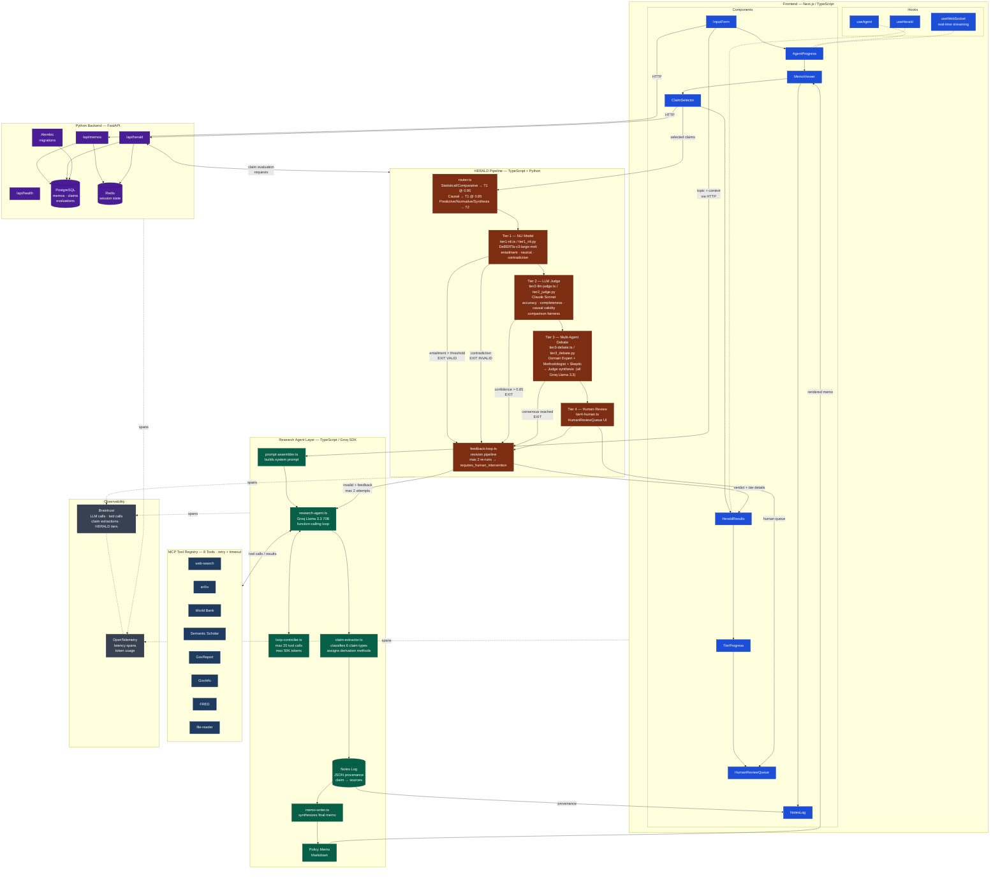
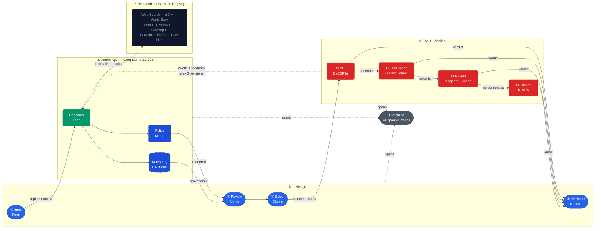
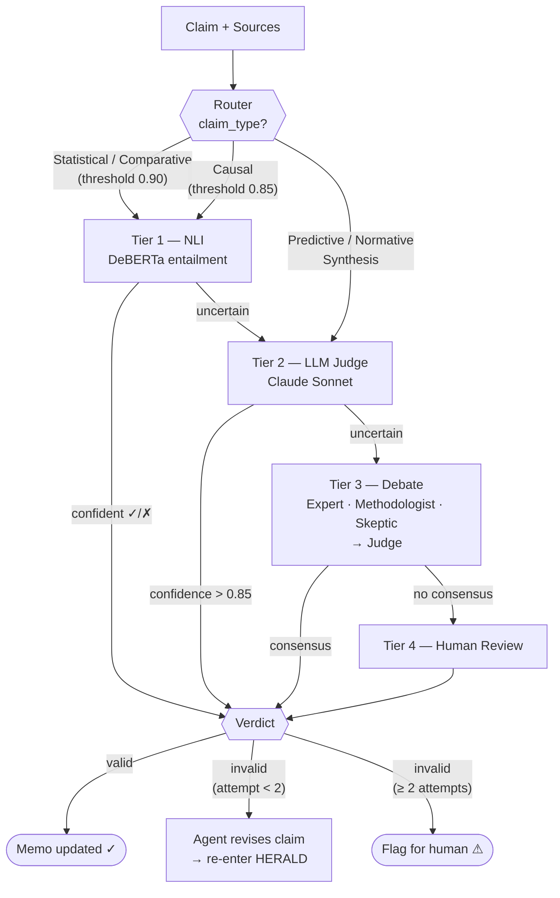

# Diagrams

## Diagram 1 — Simple Overview

---

## Diagram 2 — System Architecture (Medium)

---

## Diagram 3 — Detailed Technical Architecture

---

## Diagram 3b — Detailed Technical Architecture (Optimized)

```mermaid
flowchart LR
    classDef fe       fill:#2563eb,color:#fff,stroke:#1d4ed8
    classDef agent    fill:#059669,color:#fff,stroke:#047857
    classDef mcp      fill:#0f172a,color:#94a3b8,stroke:#334155
    classDef herald   fill:#dc2626,color:#fff,stroke:#b91c1c
    classDef py       fill:#7c3aed,color:#fff,stroke:#6d28d9
    classDef obs      fill:#4b5563,color:#fff,stroke:#374151
    classDef artifact fill:#1e40af,color:#fff,stroke:#93c5fd,stroke-dasharray:4 2

    %% ── FRONTEND ───────────────────────────────────────────────────────────
    subgraph FE["Frontend — Next.js / TypeScript"]
        direction TB
        FE1["① Input & Progress\nInputForm · AgentProgress\nuseAgent · useWebSocket"]:::fe
        FE2["② Memo Review\nMemoViewer · NotesLog\nClaimSelector"]:::fe
        FE3["③ Evaluation UI\nHeraldResults · TierProgress\nHumanReviewQueue · useHerald"]:::fe
        FE1 --> FE2 --> FE3
    end

    %% ── RESEARCH AGENT ──────────────────────────────────────────────────────
    subgraph AGT["Research Agent — TypeScript · Groq SDK"]
        direction TB
        PA["prompt-assembler.ts\n→ system prompt"]:::agent
        RA["research-agent.ts\nGroq Llama 3.3 70B\nfunction-calling loop\n— loop-controller.ts —\nmax 25 calls · 50K tokens"]:::agent
        CE["claim-extractor.ts\n6 claim types · 4 derivation methods"]:::agent
        MW["memo-writer.ts\n→ synthesizes final memo"]:::agent
        NL[("Notes Log\nJSON provenance")]:::artifact
        MM["Policy Memo\nMarkdown"]:::artifact
        PA --> RA --> CE --> NL --> MW --> MM
    end

    %% ── MCP TOOLS ───────────────────────────────────────────────────────────
    subgraph MCP["MCP Tool Registry — 8 Tools · retry + timeout"]
        MC1["web-search · arXiv · World Bank\nSemantic Scholar · GovReport\nGovInfo · FRED · file-reader"]:::mcp
    end

    %% ── HERALD ──────────────────────────────────────────────────────────────
    subgraph HER["HERALD Pipeline — TypeScript + Python"]
        direction TB
        HR["router.ts\nStatistical/Comparative → T1 @0.90\nCausal → T1 @0.85\nPredictive/Normative/Synthesis → T2"]:::herald
        T1H["Tier 1 — NLI\ntier1-nli.ts · tier1_nli.py\nDeBERTa-v3-large-mnli"]:::herald
        T2H["Tier 2 — LLM Judge\ntier2-llm-judge.ts · tier2_judge.py\nClaude Sonnet"]:::herald
        T3H["Tier 3 — Debate\ntier3-debate.ts · tier3_debate.py\nExpert · Methodologist · Skeptic + Judge"]:::herald
        T4H["Tier 4 — Human Review\ntier4-human.ts"]:::herald
        FL["feedback-loop.ts\nmax 2 revisions\n→ requires_human_intervention"]:::herald
        HR --> T1H -->|uncertain| T2H -->|uncertain| T3H -->|no consensus| T4H
        T1H & T2H & T3H & T4H --> FL
    end

    %% ── PYTHON BACKEND ──────────────────────────────────────────────────────
    subgraph PY["Python Backend — FastAPI"]
        direction TB
        API["/api/memos\n/api/herald\n/api/health"]:::py
        DB[("PostgreSQL\nmemos · claims · evaluations\nAlembic migrations")]:::py
        RD[(Redis\nsession state)]:::py
        API --> DB & RD
    end

    %% ── OBSERVABILITY ───────────────────────────────────────────────────────
    subgraph OBS["Observability"]
        direction LR
        BT["Braintrust\nLLM · tools · claims · tiers"]:::obs
        OT["OpenTelemetry\nlatency · token usage"]:::obs
        BT -.- OT
    end

    %% ── CROSS-LAYER FLOWS ───────────────────────────────────────────────────
    FE1 -->|"topic + context"| PA
    FE1 -->|"HTTP /api/memos"| API
    MM -->|"rendered memo"| FE2
    NL  -->|"provenance"| FE2
    FE2 -->|"HTTP /api/herald\nselected claims"| API
    API <-->|"evaluation requests"| HER
    FL  -->|"verdict + tier details"| FE3
    FL  -.->|"invalid + feedback"| RA
    RA  <-->|"tool calls / results"| MC1

    AGT & HER -.->|spans| BT
    FE  & PY  -.->|spans| OT
```

---

## Diagram 4 — HERALD Framework Deep Dive

```mermaid
flowchart TD
    %% ── Styles ─────────────────────────────────────────────────────────────
    classDef entry   fill:#1f2937,color:#f9fafb,stroke:#374151
    classDef router  fill:#374151,color:#f9fafb,stroke:#4b5563
    classDef t1      fill:#1d4ed8,color:#fff,stroke:#1e40af
    classDef t1exit  fill:#1e40af,color:#fff,stroke:#1d4ed8,font-weight:bold
    classDef t2      fill:#b45309,color:#fff,stroke:#92400e
    classDef t2exit  fill:#92400e,color:#fff,stroke:#b45309,font-weight:bold
    classDef t3      fill:#065f46,color:#fff,stroke:#064e3b
    classDef t3exit  fill:#064e3b,color:#fff,stroke:#065f46,font-weight:bold
    classDef t4      fill:#7c2d12,color:#fff,stroke:#6b2110
    classDef schema  fill:#4a1d96,color:#fff,stroke:#3b0764
    classDef valid   fill:#14532d,color:#fff,stroke:#166534,font-weight:bold
    classDef invalid fill:#7f1d1d,color:#fff,stroke:#991b1b,font-weight:bold
    classDef fl      fill:#1e3a5f,color:#fff,stroke:#1e40af
    classDef human   fill:#7c2d12,color:#fff,stroke:#6b2110,font-weight:bold

    %% ── ENTRY ───────────────────────────────────────────────────────────────
    ENTRY["Notes Log Claim\n─────────────────────\nclaim_text\nclaim_type  ∈  {statistical, causal, comparative,\n               predictive, normative, synthesis}\nderivation_method\nsources[]  →  relevant_chunk per source"]:::entry

    %% ── ROUTER ───────────────────────────────────────────────────────────────
    ENTRY --> ROUTER{{"router.ts\nBranch on claim_type"}}:::router
    ROUTER -->|"Statistical\nor Comparative"| T1_90["Tier 1  ·  NLI threshold = 0.90"]:::t1
    ROUTER -->|"Causal\n(lower bar: NLI catches\nmisquotes, misses\ncorrelation-as-causation)"| T1_85["Tier 1  ·  NLI threshold = 0.85"]:::t1
    ROUTER -->|"Predictive · Normative\nor Synthesis\n(NLI cannot evaluate)"| SKIP(["SKIP → go directly\nto Tier 2"]):::router

    %% ── TIER 1 ───────────────────────────────────────────────────────────────
    subgraph T1BOX["Tier 1 — NLI Model  ·  DeBERTa-v3-large-mnli"]
        direction TB
        T1RUN["Input:\n  premise  =  source relevant_chunk\n  hypothesis  =  claim_text\n\nOutput:\n  entailment / neutral / contradiction\n  + confidence score"]:::t1
        T1CHK{{"NLI result?"}}:::t1
        T1RUN --> T1CHK
    end

    T1_90 & T1_85 --> T1RUN

    T1CHK -->|"entailment confidence\n> threshold"| EX_V1(["EXIT → VALID ✓"]):::valid
    T1CHK -->|"contradiction\ndetected"| EX_I1(["EXIT → INVALID ✗"]):::invalid
    T1CHK -->|"neutral  or\nbelow threshold"| T2RUN

    %% ── TIER 2 ───────────────────────────────────────────────────────────────
    subgraph T2BOX["Tier 2 — LLM Judge  ·  Claude Sonnet"]
        direction TB
        T2RUN["Evaluates:\n  accuracy · completeness\n  causal validity\n  comparison fairness\n  projection conditionality\n  normative consensus\n\nOutput: structured verdict + confidence"]:::t2
        T2CHK{{"Confidence?"}}:::t2
        T2RUN --> T2CHK
    end

    SKIP --> T2RUN

    T2CHK -->|"confidence > 0.85"| EX_T2(["EXIT with verdict ✓/✗"]):::t2exit
    T2CHK -->|"confidence 0.60 – 0.85\nor < 0.60"| T3A

    %% ── TIER 3 ───────────────────────────────────────────────────────────────
    subgraph T3BOX["Tier 3 — Multi-Agent Debate  ·  Groq Llama 3.3 70B  ·  3 parallel calls"]
        direction LR
        T3A["Domain Expert\nsubstantive accuracy\n& field knowledge"]:::t3
        T3B["Methodologist\nevidence quality\n& inferential validity"]:::t3
        T3C["Skeptic\nadversarial challenge\n& counter-evidence"]:::t3
        T3J["Judge Synthesis\n1 call aggregates\n3 perspectives"]:::t3
        T3CHK{{"Consensus?"}}:::t3
        T3A & T3B & T3C --> T3J --> T3CHK
    end

    T3CHK -->|"unanimous  or  2-1\njudge confidence > 0.80"| EX_T3(["EXIT with verdict ✓/✗"]):::t3exit
    T3CHK -->|"no consensus  or\njudge confidence ≤ 0.80"| T4RUN

    %% ── TIER 4 ───────────────────────────────────────────────────────────────
    subgraph T4BOX["Tier 4 — Human Review"]
        direction TB
        T4RUN["Displays to reviewer:\n  · claim text\n  · all source chunks\n  · full Tier 1 – 3 outputs"]:::t4
        T4OUT["Human verdict\n+ optional notes"]:::t4
        T4RUN --> T4OUT
    end

    %% ── HERALD OUTPUT SCHEMA ─────────────────────────────────────────────────
    EX_V1  --> SCHEMA
    EX_I1  --> SCHEMA
    EX_T2  --> SCHEMA
    EX_T3  --> SCHEMA
    T4OUT  --> SCHEMA

    SCHEMA["HERALD Output Schema\n──────────────────────────────\nclaim_id\ntier_reached\nverdict          valid · invalid · needs_revision\nconfidence\nfeedback\nsuggested_revision\ntier_details\n  tier_1:  { verdict, confidence, nli_label }\n  tier_2:  { verdict, confidence, reasoning }\n  tier_3:  { domain_expert, methodologist,\n             skeptic, judge_synthesis }\n  tier_4:  { human_verdict, notes }"]:::schema

    %% ── FEEDBACK LOOP ────────────────────────────────────────────────────────
    subgraph FL["Feedback Loop  ·  feedback-loop.ts"]
        direction TB
        FL1{{"verdict  =  valid?"}}:::fl
        FL2(["Update memo text\n+ notes log entry\nmark resolved ✓"]):::valid
        FL3{{"revision_count < 2?"}}:::fl
        FL4["Send to Groq agent:\n  original claim\n  + HERALD feedback\n  + suggested_revision\n  → re-run full HERALD pipeline"]:::fl
        FL5(["Flag: requires_human_intervention\nsurface in UI ⚠"]):::human

        FL1 -->|"yes"| FL2
        FL1 -->|"no  (invalid or\nneeds_revision)"| FL3
        FL3 -->|"yes"| FL4
        FL3 -->|"no  (≥ 2 attempts)"| FL5
        FL4 -->|"revised claim\nre-enters HERALD"| FL4_OUT(["→ HERALD router"]):::router
    end

    SCHEMA --> FL1
```

---

## Diagram 2b — System Architecture (Optimized)

---

## Diagram 4b — HERALD Framework (Condensed)

