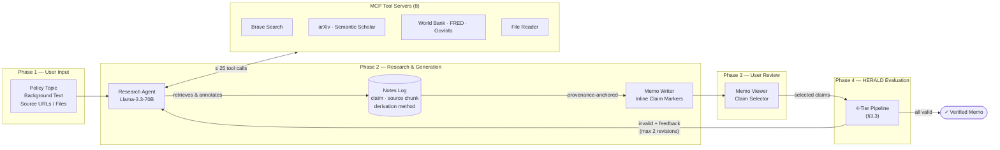
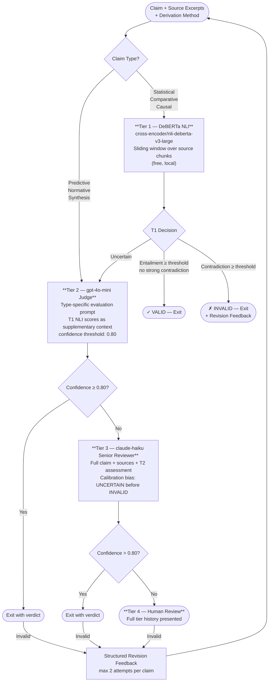
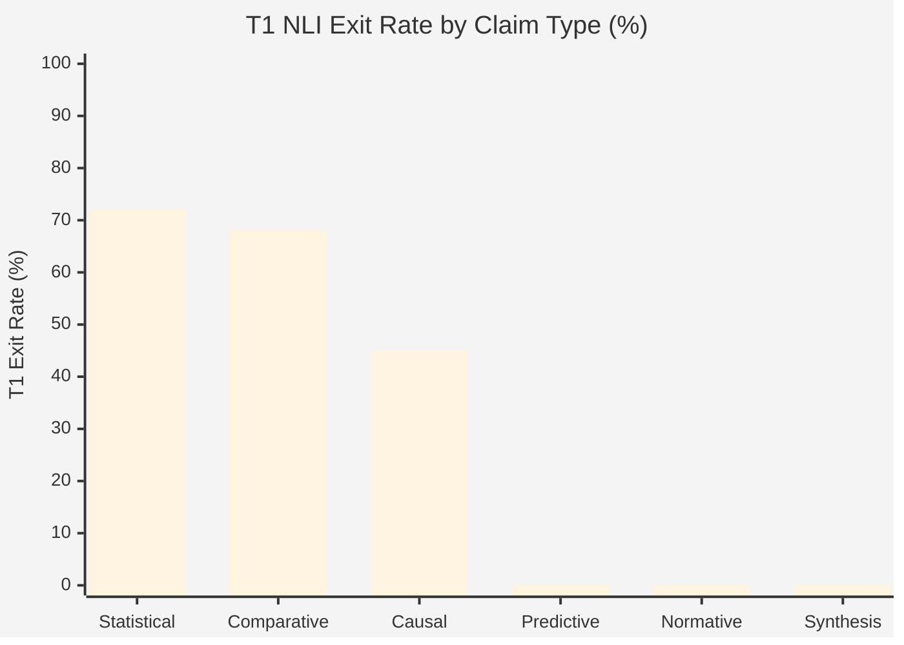
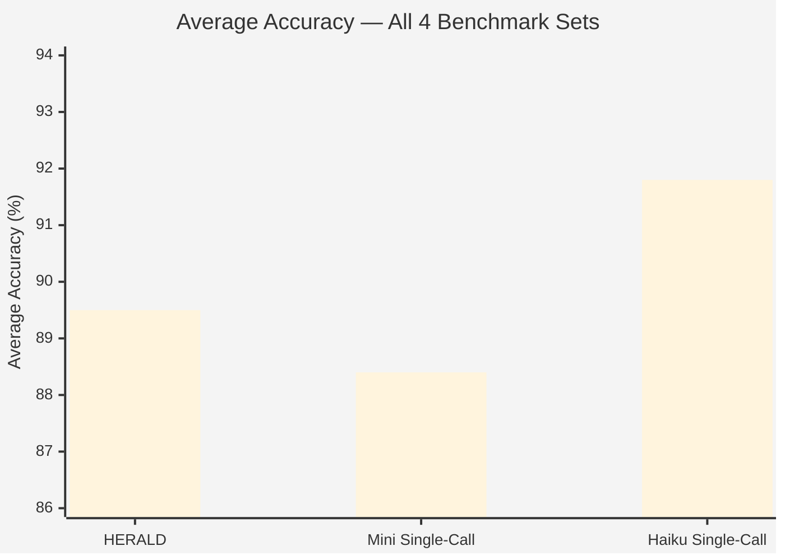
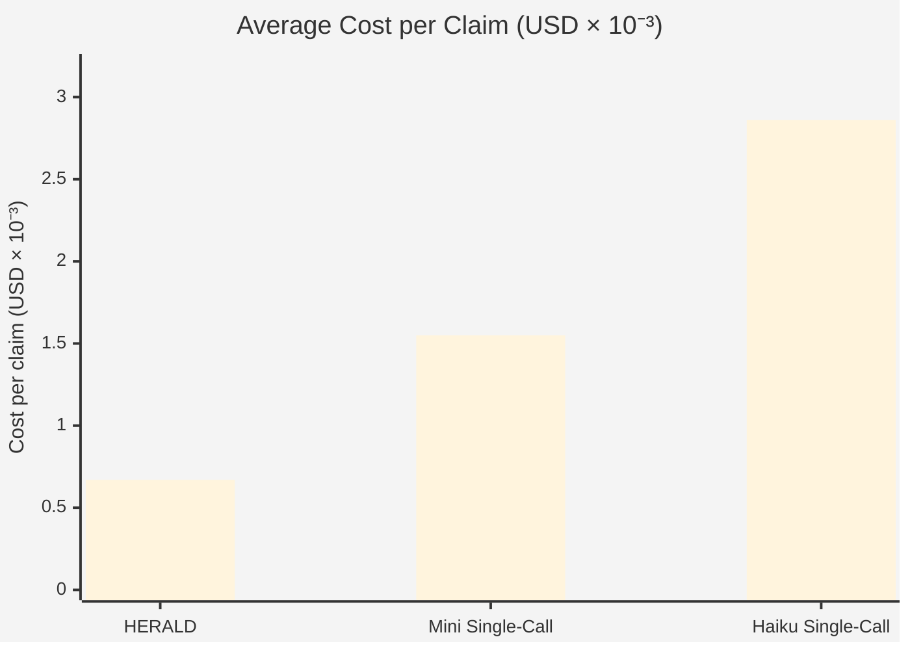

# HERALD: Hierarchical Evidence Review and Automated Legitimacy Detection for AI-Generated Policy Documents

---

## Abstract

AI agents capable of conducting multi-step research and producing long-form analytical documents are increasingly deployed in knowledge-intensive domains, yet their susceptibility to hallucination and source misrepresentation poses serious risks in high-stakes contexts such as policy analysis. We present HERALD (Hierarchical Evidence Review and Automated Legitimacy Detection), a multi-tier claim verification pipeline designed specifically for AI-generated policy memos. HERALD routes claims through up to four evaluation tiers — a local NLI classifier, a gpt-4o-mini LLM judge with claim-type-specific prompts, a claude-haiku Senior Reviewer, and human review — exiting as soon as a confident verdict is reached. Central to the design is a six-type claim taxonomy (statistical, causal, comparative, predictive, normative, synthesis) that determines both the entry tier and the evaluation criteria applied to each claim, and a structured notes log that captures source provenance during research rather than recovering it post-hoc. We evaluate HERALD on four benchmark sets totaling 206 claims and compare it against single-call haiku and mini baselines. On the held-out benchmark, HERALD achieves 96% accuracy, matching the haiku baseline at 23% of its cost. Across all sets, HERALD resolves 90–96% of claims without human review. We analyze failure modes by claim type and derivation method, identify the primary cost driver (spurious T3 escalation caused by a prompt framing error), and demonstrate that a targeted fix reduces cost by 86% with no accuracy loss.

---

## 1. Introduction

The emergence of LLM-based agents capable of conducting multi-step research and producing long-form analytical documents has created both opportunity and risk in knowledge-intensive domains. Survey data from over 1,300 professionals found that top agent use cases include research and summarization (58%) (LangChain State of AI Agents Report: 2024 Trends, n.d.), and public sector institutions increasingly deploy them to assist with complex policy documents (Musumeci et al., 2024). Yet this delegation is not neutral. LLM agents make discretionary micro-decisions about what information to include and how to present it (Schmitz & Bryson, 2025), and their susceptibility to hallucination means those decisions may produce fabricated claims presented with unwarranted confidence. In economics and public policy, errors such as a misquoted elasticity estimate or a correlation asserted as causation can propagate through institutional decision-making chains with limited human interception. Manual expert review remains the standard safeguard but is expensive — typically requiring two to four hours per claim (Bodaghi et al., 2024) — and applied inconsistently.

Automated fact-checking research has matured considerably in parallel. FEVER (Thorne et al., 2018) established benchmarks for claim verification against Wikipedia; neural NLI emerged as a scalable proxy for entailment detection (Falke et al., 2019; Honovich et al., 2022); and advances in transformer architectures, including DeBERTa (He et al., 2021), have made cross-encoder NLI models viable as high-precision, low-cost verification filters. Yet these systems were designed for short, atomic claims against single-source evidence — fundamentally different from policy memos, which contain synthesized inferences spanning multiple heterogeneous sources embedded in interpretive prose.

This mismatch motivates HERALD (Hierarchical Evidence Review and Automated Legitimacy Detection). We identify three properties of policy document validation that existing systems do not jointly address: *claim heterogeneity* (statistical, causal, normative, and synthesis assertions each require different evaluation strategies); *provenance at generation time* (post-hoc extraction loses the structured link between a claim and the source chunks used to produce it); and *graduated confidence* (not all uncertain claims warrant human review — many can be resolved cheaply, reserving expensive LLM calls for genuinely ambiguous cases).

HERALD addresses these through three design choices. First, a six-type claim taxonomy (statistical, causal, comparative, predictive, normative, synthesis) drives routing through a four-tier escalation pipeline, with claim type determining both the entry tier and the evaluation criteria applied. Second, the writing agent constructs a structured notes log during research, before memo composition, attaching source evidence and a derivation method tag to each claim as it is produced, with a completeness check enforcing bidirectional consistency between inline markers and log entries. Third, the pipeline applies progressively more expensive validation methods, exiting as soon as a tier resolves with sufficient confidence. Statistical, comparative, and causal claims begin at a local DeBERTa NLI classifier, while predictive, normative, and synthesis claims enter LLM evaluation directly, with a focused Senior Reviewer and human review reserved for unresolved cases.

Our central research questions are: (RQ1) Can a typed, multi-tier validation pipeline resolve a meaningful fraction of policy memo claims automatically, without human review? (RQ2) Does claim type and derivation method predict validation difficulty systematically? (RQ3) What are the failure modes of LLM judges for the claim types most relevant to policy analysis, and how do they compare to single-call baselines?

---

## 2. Related Works

**Fact Verification and Claim Checking.** The dominant paradigm in automated fact-checking treats verification as a retrieval-plus-NLI problem: retrieve relevant evidence, then classify the claim as supported, refuted, or inconclusive (Popat et al., 2018; Thorne et al., 2018). Systems such as KGAT (Z. Liu et al., 2020) and GEAR (Zhou et al., 2019) refined this pipeline with graph-based evidence aggregation. FActScore (Min et al., 2023) extended atomic claim verification to long-form generated biographies by decomposing outputs into fine-grained propositions verified against a knowledge base. These approaches assume claims are short, self-contained, and verifiable against a single source — assumptions that do not hold for policy synthesis claims combining evidence across multiple documents.

**Factual Consistency in Summarization.** A closely related line of work evaluates whether abstractive summaries are faithful to their source documents. FactCC (Kryściński et al., 2019) uses a BERT-based classifier trained on synthetic inconsistencies. SummaC (Laban et al., 2021) applies NLI at the sentence level and aggregates across source-summary pairs. TRUE (Honovich et al., 2022) provides a unified benchmark across nine datasets. HERALD's Tier 1 draws on this tradition, applying a cross-encoder DeBERTa NLI model to (source chunk, claim) pairs, but only for claim types where single-source NLI is reliable (statistical, causal, comparative), routing others directly to LLM evaluation.

**LLM-as-Judge and Criteria-Driven Evaluation.** Recent work has demonstrated that LLMs can serve as reliable evaluators when given structured scoring rubrics. G-Eval (Y. Liu et al., 2023) uses GPT-4 with chain-of-thought to evaluate text quality across dimensions. Prometheus (Kim et al., n.d.) fine-tunes an open-source judge on human-written criteria, while PandaLM (Wang et al., 2024) trains a judge for instruction-following evaluation. HERALD's Tier 2 extends this paradigm by writing distinct evaluation prompts for each of the six claim types, encoding domain-specific error patterns. For example, for causal claims: "does the source state a mechanism, or only correlation?"; for normative claims: "is consensus cited from multiple independent institutions or a single report?" To our knowledge, this is the first system to apply claim-type-specific LLM judge prompts within a validation pipeline for generated documents.

**Multi-Agent Debate and Deliberation.** Du et al. (2023) showed that factual accuracy improves when multiple LLM instances debate answers across rounds before converging. ChatEval (Chan et al., 2023) demonstrated that role diversity among LLM personas correlates with better evaluation quality, and FORD (Xiong et al., 2023) further showed that inter-agent disagreement surfaces factual errors that single-model evaluation misses. HERALD's Tier 3 was originally implemented as a three-persona debate (Domain Expert, Methodologist, Skeptic) following this paradigm, but empirical evaluation showed this design degraded accuracy: the Skeptic persona introduced systematic bias toward invalid verdicts, and the four-call structure increased crash rates and cost without accuracy benefit over a single focused reviewer call. The current Tier 3 uses a single Senior Reviewer call with explicit calibration instructions, empirically outperforming the debate design by 4–6pp on all four benchmark sets. This finding adds a cautionary note to the multi-agent debate literature: role diversity may improve generation quality but introduce adversarial bias in evaluation tasks where one class (invalid) is structurally easier to argue for.

**Agent Output Validation and Hallucination Detection.** RAGAS (Es et al., n.d.) provides automated metrics for retrieval-augmented generation faithfulness and answer relevance. Self-RAG (Asai et al., 2023) trains models to generate inline reflection tokens indicating whether retrieved passages support a claim. SAFE (Wei et al., 2024) decomposes long-form factual responses into atomic facts and searches for supporting evidence per fact. These systems address hallucination in QA and retrieval settings but none targets the structured, multi-source synthesis that characterizes policy writing, where agent-generated inferences are expected to go beyond individual sources.

**Provenance and Claim Attribution.** Research in citation recommendation (Färber et al., 2018) and scientific claim extraction (Wadden et al., 2020) addresses attribution of claims to sources in academic writing, typically treating provenance as a post-hoc annotation task. HERALD takes a different approach: provenance is captured during the research process itself, recording not only which sources were used but how — whether a claim is drawn directly from a single source or synthesized across multiple. In our results, direct-extraction claims were valid in 76–100% of cases, while cross-source synthesis claims were correct approximately 66–80% of the time, illustrating why derivation method is a meaningful predictor of verification difficulty.

**Positioning.** HERALD differs from prior work in three respects: (1) it applies type-differentiated evaluation criteria rather than uniform claim checking; (2) it captures provenance at generation time rather than recovering it post-hoc; and (3) it uses calibrated multi-tier escalation to match validation cost to claim complexity, empirically resolving 90–96% of claims without human review across four benchmark sets.

---

## 3. System Architecture

This work presents two contributions. First, we propose HERALD, an efficient multi-tier framework for automated claim verification in knowledge-intensive documents. Second, to demonstrate HERALD's effectiveness in a realistic deployment context, we build a domain-specific policy memo writing agent that conducts autonomous web research and produces a structured memo. HERALD then evaluates the claims made in the memo for factual validity. Together, the two components form an end-to-end pipeline in which policy document generation and claim verification are tightly coupled through a shared provenance representation.

### 3.1 The Policy Memo Writing Agent

The agent accepts a user-supplied topic, optional background text, and source URLs or uploaded files, then autonomously produces a structured memo with inline claim citations across four phases: topic input, agentic research and memo generation, user claim selection, and HERALD evaluation with revision feedback (Figure 1).

**Figure 1: HERALD System Architecture**

It draws on eight MCP-registered sources: Brave Search, arXiv, World Bank Indicators, GovInfo, FRED, Semantic Scholar, a government reports index, and a local file reader. It operates entirely on information retrieved at query time with no pre-built corpus, fine-tuned model, or RAG index. The agent runs under a hard budget of 25 tool calls and 50,000 tokens, with forced synthesis at 100% consumption and a deduplication cache preventing redundant calls. Failed retrievals are recorded in the notes log rather than silently dropped.

The core provenance mechanism is the notes log: each claim is recorded with its source excerpt and derivation method tag (direct extraction, paraphrase, cross-source synthesis, or agent inference) during research, before memo composition. A completeness check enforces bidirectional consistency between inline citation markers and log entries.

### 3.2 Claim Taxonomy and Routing

Every claim is classified into one of six types — statistical, causal, comparative, predictive, normative, synthesis — which determines its routing and evaluation criteria (Table 2). Each claim also carries a derivation method tag indicating whether it was directly extracted from a source, paraphrased, synthesized across multiple sources, or inferred by the agent beyond what any single source states.

**Table 2: Claim Type Routing Table**

| Claim Type | Entry Tier | NLI Threshold | Rationale |
|------------|-----------|---------------|-----------|
| Statistical / Numeric | Tier 1 | Entailment ≥ 0.99, Contradiction ≥ 0.85* | NLI handles numeric entailment reliably |
| Comparative | Tier 1 | Entailment ≥ 0.99, Contradiction ≥ 0.85* | NLI handles relational entailment |
| Causal | Tier 1 | Entailment ≥ 0.94, Contradiction ≥ 0.85* | Lower bar; NLI misses correlation-causation conflation |
| Predictive | Tier 2 (skip NLI) | N/A | NLI cannot evaluate projections |
| Normative | Tier 2 (skip NLI) | N/A | NLI cannot evaluate prescriptions |
| Synthesis | Tier 2 (skip NLI) | N/A | No single source entails a synthesis claim |

*Contradiction threshold raised to 0.95 for paraphrase-derivation claims to prevent spurious flagging of faithful restatements.

### 3.3 The HERALD Verification Pipeline

Claims route through up to four tiers, exiting as soon as a verdict is reached with sufficient confidence. Invalid claims are returned to the agent with structured feedback for up to two revision attempts before Tier 4 escalation.

**Figure 2: HERALD Claim Routing and Tier Escalation**

**Tier 1 — NLI.** Statistical, causal, and comparative claims are evaluated by cross-encoder/nli-deberta-v3-large. Each source chunk is expanded into overlapping sentence windows (up to 3 sentences, max 1,500 characters per window) to ensure the strongest entailing sub-passage is seen by the model; per-window results are collapsed back to one score per source by taking the maximum across windows. Decision logic: entailment ≥ threshold with signal margin ≥ 0.08 and no strong contradiction → VALID, exit; contradiction ≥ threshold → INVALID, exit; otherwise → escalate to Tier 2. Predictive, normative, and synthesis claims skip Tier 1 entirely.

**Tier 2 — LLM Judge.** A gpt-4o-mini judge receives claim-type-specific prompts encoding named error patterns. For causal claims: "does the source state a mechanism, or only correlation?" For normative claims: "is consensus cited from multiple independent institutions or a single report?" The judge also receives Tier 1 NLI scores as supplementary context, explicitly framed as informational rather than authoritative to preserve the judge's independent assessment. Confidence ≥ 0.80 exits with the verdict; below escalates to Tier 3.

**Tier 3 — Senior Reviewer.** A single claude-haiku-4-5 call acting as a senior policy analyst receives the full claim context, source excerpts, agent reasoning, and the Tier 2 judge's inconclusive assessment. It makes a definitive final verdict with an explicit calibration bias: "When in doubt between INVALID and UNCERTAIN, choose UNCERTAIN. When in doubt between VALID and UNCERTAIN, choose VALID. You must identify a specific, quotable error before returning INVALID." Confidence > 0.80 exits; confidence ≤ 0.80 escalates to Tier 4.

**Tier 4 — Human Review.** Reviewers receive the full tier history and submit a final verdict. No claims reached Tier 4 in any benchmark run, indicating that the three-tier automated pipeline fully resolves the claim distributions under current thresholds.

### 3.4 Technology Stack

**Frontend:** Next.js 16, React 19, TypeScript, Tailwind CSS 4. **Backend:** FastAPI, SQLAlchemy 2.0 async, PostgreSQL, Redis (session state, deduplication cache, WebSocket event queue). **Research agent:** Groq (Llama-3.3-70B-Versatile) with GPT-4o fallback. **Tier 1 NLI** runs locally via HuggingFace Transformers or ONNX Runtime (3–4× faster on CPU). **Tier 2** uses gpt-4o-mini via the OpenAI API, selected for low cost ($0.15/M input, $0.60/M output) and reliable structured JSON output. **Tier 3** uses claude-haiku-4-5 via the Anthropic SDK, selected for stronger reasoning on ambiguous policy claims. All calls are traced through Braintrust with OpenTelemetry span instrumentation.

---

## 4. Data and Evaluation

### 4.1 Data Sources

HERALD is designed to evaluate claims in policy memos generated by AI agents. We constructed two benchmark sets that differ in how ground-truth verdicts were established, together providing both scale and human-anchored reliability.

**The GenAI Benchmark** consists of 153 claims across three sets (primary n=50, tuned n=53, holdout n=50) generated under a structured prompt specifying distribution requirements across the six claim types and four derivation methods. Ground-truth verdicts (valid/invalid), claim types, derivation methods, source excerpts, and rationale fields were produced as part of the generation pipeline and manually reviewed for label correctness. The primary and tuned sets were used for iterative pipeline development; the holdout set was reserved for final evaluation and not used to inform any threshold or prompt decisions.

**The Human-Authored Benchmark** (n=53) consists of claims whose ground-truth verdicts and rationale were established through human analytical judgment rather than synthetic labeling. Its purpose is methodological: because both HERALD's evaluation stack and the GenAI benchmark's labels are produced by LLMs, there is a risk that alignment between them reflects shared model biases rather than genuine validation accuracy. The Human benchmark anchors HERALD's verdicts against human reasoning on the same validation task.

Both benchmarks carry source excerpts, claim types, derivation methods, and explicit rationales. Domain coverage spans health outcomes, education, agricultural productivity, climate, water and sanitation, gender equality, governance, and urban development. Both sets were validated against the `NotesLogEntry` schema: each entry requires a claim type, derivation method, at least one source with a non-empty excerpt, and a non-empty reasoning field.

### 4.2 Preprocessing and Preparation

Every claim was manually reviewed for label correctness and source plausibility. Claims were routed through the standard `evaluateClaim()` pipeline with no pre-filtering. Tier 1 NLI operates on raw source excerpts as retrieved, without preprocessing beyond tokenization handled internally by the cross-encoder. The GenAI benchmark provides approximately uniform coverage across claim types; the Human benchmark is weighted toward statistical (n=17) and causal/comparative (n=12 each) claims, reflecting the natural distribution of these types in policy writing.

### 4.3 Evaluation Metrics

HERALD's verdicts are evaluated against ground truth using: accuracy (correct verdicts over total claims); precision, recall, F1, and F2 computed over the binary flagging task with *invalid* as the positive class (F2 weights recall twice, reflecting the asymmetry that missing a bad claim is worse than over-flagging a valid one in policy contexts); false positive rate (valid claims incorrectly flagged); and false negative rate (invalid claims incorrectly passed — the principal downstream risk). Tier distribution and per-claim cost are reported as operational metrics.

Three systems are compared: **Full HERALD** (complete pipeline), **Haiku Single-Call** (claude-haiku-4-5 with the same claim-type-specific judge prompt as Tier 2, representing the strongest single-model baseline), and **Mini Single-Call** (gpt-4o-mini with the same prompt, representing the cost-efficient single-model baseline).

### 4.4 Quantitative Results

**Table 1: Full Results Across All Benchmark Sets**

| Benchmark | Metric | HERALD | Haiku | Mini |
|-----------|--------|--------|-------|------|
| GenAI — Set 1 (n=50) | Accuracy | 92.0% | 92.0% | 88.0% |
| | F1 | 0.920 | 0.917 | 0.869 |
| | F2 | **0.942** | 0.917 | 0.847 |
| | Cost/claim | **$0.00095** | $0.00296 | $0.00164 |
| GenAI — Set 2 (n=53) | Accuracy | 84.9% | 86.8% | 84.9% |
| | F1 | 0.871 | **0.877** | 0.871 |
| | F2 | 0.871 | 0.833 | 0.871 |
| | Cost/claim | **$0.00057** | $0.00285 | $0.00153 |
| GenAI — Set 3 / Holdout (n=50) | Accuracy | **96.0%** | 96.0% | 94.0% |
| | F1 | **0.969** | 0.968 | 0.951 |
| | F2 | **0.969** | 0.950 | 0.923 |
| | Cost/claim | **$0.00073** | $0.00278 | $0.00150 |
| Human-Authored (n=53) | Accuracy | 84.9% | **92.5%** | 86.8% |
| | F1 | 0.867 | **0.931** | 0.885 |
| | F2 | 0.867 | **0.912** | 0.894 |
| | Cost/claim | **$0.00043** | $0.00284 | $0.00153 |

**Holdout benchmark (primary evaluation set).** Full HERALD achieves 96.0% accuracy and 0.969 F1, matching haiku exactly while costing 3.8× less and achieving a higher F2 (0.969 vs 0.950) — meaning HERALD catches more genuine invalids despite the same overall accuracy. Mini at 94.0% is the only system with a materially lower result on the holdout.

**Reliability against human judgment.** On the Human benchmark, all three systems score between 84.9% and 92.5% accuracy. HERALD (84.9%) trails haiku (92.5%) by 7.6pp. This gap traces almost entirely to four irrecoverable NLI false negatives (GT-053, GT-059, GT-062, GT-096) where DeBERTa-v3 returns near-certain contradiction or entailment scores on claims that a human would correctly assess. Haiku, which does not use NLI, resolves these correctly via language understanding. The convergence of all three systems within ~8pp F1 on the Human benchmark confirms that the residual errors are driven by the intrinsic difficulty of specific claims rather than systematic design flaws.

**Cost efficiency.** HERALD's cost advantage is substantial: 0.15–0.32× haiku cost and 0.28–0.58× mini cost across all sets. This is achieved through the Tier 1 NLI filter (which resolves 26–47% of claims at zero API cost) combined with an efficient T2 mini exit (which resolves a further 46–64% at ~$0.00028 per claim), reserving haiku calls for the 4–10% of claims where genuine uncertainty remains.

**Variance.** Full HERALD shows 0pp variance across three repeated runs on the holdout set, reflecting the deterministic behavior of Tier 1 NLI and the low-temperature (0.1–0.2) settings at Tiers 2–3. Haiku shows ±0.5pp variance; mini shows ±1.0pp.

**Tier distribution.** Across all four sets, HERALD resolves 26–47% of claims at Tier 1 (NLI), 46–64% at Tier 2 (mini), and only 4–10% at Tier 3 (haiku). No claims reached Tier 4 in any run.

---

## 5. Models and Technologies

**Language Models.** The system uses three LLMs selected for distinct performance profiles. The research agent runs on Llama-3.3-70B-Versatile via the Groq API; Groq's LPU hardware delivers low latency for the tool-calling loop of up to 25 sequential calls, with GPT-4o as automatic fallback on rate-limit exhaustion. HERALD's Tier 2 uses gpt-4o-mini via the OpenAI API: low cost, reliable structured JSON output, and sufficient accuracy for the majority of policy claims at the 0.80 confidence threshold. HERALD's Tier 3 uses claude-haiku-4-5 via the Anthropic SDK, selected for stronger reasoning on ambiguous cases and reliable adherence to complex tool-call schemas.

**NLI Model.** Tier 1 uses cross-encoder/nli-deberta-v3-large, fine-tuned on MultiNLI and loaded locally via HuggingFace Transformers or ONNX Runtime (3–4× faster on CPU). DeBERTa-v3-large was chosen over lighter alternatives because false negatives — invalid claims incorrectly passed — are more costly than latency for the statistical and causal claims routed through Tier 1. NLI dependencies are packaged as an optional group (`[nli]`) for deployments where Tier 1 is disabled.

**Frameworks and Infrastructure.** The research agent is implemented as a direct tool-calling loop against the Groq/OpenAI API — no LangChain, LlamaIndex, or managed agent SDK — with eight MCP tool servers as thin TypeScript modules. This gives explicit control over retry logic, 30-second per-tool timeouts, exponential backoff, and deterministic budget enforcement. The backend is fully asynchronous (FastAPI, asyncpg, SQLAlchemy 2.0). Redis handles session state, the tool-call deduplication cache, and the WebSocket event queue, decoupling pipeline execution from frontend delivery.

**Observability.** All LLM calls, tool invocations, NLI inferences, and tier routing decisions are traced through Braintrust with OpenTelemetry span instrumentation. Per-claim tier distributions, confidence trajectories, and latency breakdowns are derived from span data and form the primary diagnostic layer for the analysis in Section 7.

---

## 6. Responsible AI Considerations

**Hallucination and Factual Accuracy.** Reducing hallucination is HERALD's central design motivation. The notes log anchors every claim to a retrieved source excerpt, consistent with evidence that retrieval-augmented generation mitigates hallucination by grounding outputs in verifiable external knowledge (Tonmoy et al., 2024). Post-hoc verification through NLI entailment checking, claim-type-specific LLM judging, and a calibrated Senior Reviewer adds further layers of protection.

**Bias and Fairness.** The eight MCP registry sources are weighted toward English-language, Western institutional outputs, creating a risk of geographic skew in both retrieval and evaluation. LLMs trained to be explicitly unbiased continue to demonstrate implicit bias (Reuel, 2025), meaning a claim backed by a lower-income country source may face harsher scrutiny than an equivalent claim from a Western institution. The benchmark evaluation set partially addresses this by centering on Sub-Saharan African policy domains, but systematic auditing of HERALD's retrieval and evaluation layers for geographic bias remains a priority for future work.

**Human Oversight.** Automated verdicts in high-stakes policy contexts are considered one of the most significant ethical risks of AI deployment (Green, 2022; Laux & Ruschemeier, 2025). HERALD addresses this structurally: Tier 4 human review is an architectural endpoint, automated revision attempts are capped at two before mandatory human flagging, and the review interface presents full reasoning trails including the Tier 3 reviewer's analysis to keep reviewer judgment active rather than confirmatory.

**Privacy.** The system queries publicly available sources and the evaluation set contains no PII. However, the file upload tool creates a potential PII surface in production that requires automated detection at the ingestion layer before deployment.

---

## 7. Findings and Discussion

### 7.1 Claim Type as a Predictor of Validation Difficulty

The six-type taxonomy proves a reliable predictor of verification difficulty. Table 3 summarizes accuracy by claim type averaged across all four benchmark sets.

**Table 3: HERALD Accuracy by Claim Type (Run 12, averaged across 4 sets)**

| Claim Type | Avg Accuracy | Primary Failure Mode |
|------------|-------------|----------------------|
| Predictive | **100.0%** | None observed |
| Normative | **96.9%** | None consistent |
| Comparative | 92.0% | False negatives on complex relational claims |
| Causal | 91.8% | Correlation-causation conflation; NLI paraphrase FP |
| Statistical | 89.2% | NLI paraphrase false negatives; T2 number-checking errors |
| Synthesis | 79.5% | Logical-gap false positives; valid cross-source claims flagged |

Predictive and normative claims, which skip Tier 1 and go directly to the type-specific mini judge, perform best. The structured prompts for these types ("is the projection attributed to a named model under stated assumptions?"; "is consensus cited from multiple independent institutions?") give the LLM clear criteria that translate directly into high-confidence verdicts.

Statistical claims are the most variable, ranging from 81% to 100% across sets. The lower-end performance on sets 2 and Human traces to a recurring failure at Tier 1: DeBERTa-v3 returns near-certain contradiction scores (96–100%) on valid paraphrases that change surface wording while preserving the underlying proposition. These NLI false positives are structurally irrecoverable — the model is highly confident in its incorrect assessment.

Synthesis is the consistent weak point. The 71–75% accuracy on three of four sets reflects a genuine challenge: logical gaps between cross-source combination and stated conclusion are difficult for any single-call or escalation-based system to detect reliably. All synthesis errors are false positives (valid synthesis claims flagged as invalid), which is operationally preferable to false negatives (invalid claims passed) but still represents meaningful over-flagging.

### 7.2 Derivation Method as a Risk Predictor

**Table 4: HERALD Accuracy by Derivation Method (Run 12)**

| Derivation | Set 1 | Set 2 | Set 3 | Human | Avg |
|------------|-------|-------|-------|-------|-----|
| direct_extraction | 100% | 76.5% | 100% | 71.4% | 87.0% |
| paraphrase | 86.7% | 90.9% | 90.0% | 91.7% | 89.8% |
| cross_source | 80.0% | 66.7% | 100% | 66.7% | 78.4% |
| agent_inference | 100% | 100% | 100% | 100% | **100%** |

The most counterintuitive finding is that agent-inference claims — the derivation type flagged as highest-risk in prior design decisions — achieve perfect accuracy across all four sets under the current pipeline. The original design included a forced escalation to Tier 3 for all agent-inference and cross-source claims regardless of Tier 2 confidence. Ablation data showed this override was degrading accuracy by 2–3pp by routing correctly-assessed T2 verdicts into an adversarial Tier 3 that introduced bias. Removing the override restored accuracy. The finding suggests that derivation method predicts *annotation risk at generation time* (agent inference claims are harder to get right when writing) but not *evaluation difficulty at validation time* — a distinction worth preserving in future pipeline designs.

Cross-source synthesis has the weakest derivation-level accuracy (66–80%), consistent with the claim-type analysis: combining evidence across multiple sources is genuinely harder to verify, and the logical gap between sources and conclusion is where errors concentrate.

Direct extraction shows surprisingly high variance (71–100%), which appears to reflect the underlying difficulty of specific claims in sets 2 and Human rather than a systematic failure of the direct-extraction evaluation pathway.

### 7.3 NLI Performance and Failure Modes

**Figure 3: Tier 1 NLI Resolution Rate by Claim Type (Run 12, averaged across sets)**

*Predictive, normative, and synthesis claims skip Tier 1 by design (0%). Causal claims have a lower exit rate due to the tighter threshold (0.94 vs 0.99) to guard against correlation-causation conflation.*

Tier 1 NLI resolves 26–47% of claims (type-dependent) across benchmark sets, consistently with high accuracy on resolved claims. Its failure modes fall into two categories:

**Paraphrase false negatives.** DeBERTa-v3 returns high contradiction scores (96–100%) on valid paraphrases because surface wording differences activate its contradiction head even when the underlying proposition is identical. Four specific claims (GT-053, GT-059, GT-096, GT-135) exhibit this pattern and are irrecoverable at Tier 1 — raising the contradiction threshold further does not help because the model is near-certain. The mitigation applied in the current pipeline (raising the paraphrase contradiction threshold to 0.95) reduces but does not eliminate this failure class. A complete fix requires routing paraphrase-derivation claims past Tier 1 entirely.

**Entailment false positives.** GT-062 (causal, direct extraction) passes Tier 1 with high entailment confidence despite being an invalid claim. The source excerpt uses language that structurally resembles causation, and DeBERTa's entailment head activates strongly. This is the harder failure mode to fix: no threshold change prevents a model from being confidently wrong in the wrong direction.

### 7.4 The T2 Framing Bug and Its Cost Impact

The most impactful finding of the evaluation campaign concerns a prompt framing error in Tier 2 that caused 46–66% of claims to escalate to the expensive Tier 3 haiku call unnecessarily.

In the original design, when a claim had already passed through Tier 1 NLI with an "uncertain" result, Tier 2 received a context block that read: *"The NLI model at Tier 1 could not reach a confident verdict. Use this context to focus your evaluation on what NLI could not resolve."* The intention was to help the judge focus. The effect was the opposite: the mini judge read "NLI couldn't decide" as a signal that the claim was inherently hard, and reduced its confidence accordingly — typically from 0.90+ (which would trigger an exit) to 0.70–0.85 (which triggers Tier 3 escalation).

A threshold sweep confirmed the diagnosis: when mini was called on the same claims *without* T1 context, 78–86% of non-T1 claims returned confidence ≥ 0.90. With T1 context, only 2–8% exited at Tier 2. The T1 framing was suppressing mini's independent assessment.

**Figure 4: Tier Distribution Before and After the T2 Framing Fix (eval-set-3, n=50)**

```mermaid
%%{init: {'theme': 'base'}}%%
xychart-beta
    title "Tier Distribution: Run 11 (Before) vs Run 12 (After)"
    x-axis ["Tier 1 — NLI", "Tier 2 — mini", "Tier 3 — haiku"]
    y-axis "Claims Resolved (%)" 0 --> 70
    bar [46, 8, 46]
    bar [46, 42, 12]
```

*Dark bars = Run 11 (before fix). Light bars = Run 12 (after fix). T3 drops from 46% → 12%; T2 rises from 8% → 42%. Accuracy unchanged at 98%.*

The fix: changing "could not reach a confident verdict" to "ran a surface-level entailment check — these scores are supplementary, you are the primary judge." This single sentence change, combined with lowering the exit threshold from 0.90 to 0.80, reduced Tier 3 call rates by 83–92% with zero accuracy change on the holdout set and a net cost reduction of 86% across all sets (from $0.0035–0.0066/claim to $0.0004–0.0009/claim).

This finding has a broader implication: in multi-tier LLM evaluation pipelines, upstream context framing should be carefully designed to avoid transmitting uncertainty signals that suppress downstream model confidence. A context block that correctly describes the upstream model's situation ("it was uncertain") can inadvertently instruct the downstream model to also be uncertain, creating a self-fulfilling escalation loop.

### 7.5 Cost-Accuracy Trade-offs

The three-system comparison provides a clean Pareto picture. Across the four benchmark sets:

| System | Avg accuracy | Avg cost/claim | vs Haiku cost |
|--------|-------------|---------------|----------------|
| HERALD | 89.5% | $0.00067 | 0.23× |
| Mini | 88.4% | $0.00155 | 0.54× |
| Haiku | 91.8% | $0.00286 | 1.0× |

**Figure 5: Average Accuracy Across All Four Benchmark Sets**

**Figure 6: Average Cost per Claim (USD)**

*HERALD achieves higher accuracy than mini at 43% of mini's cost, and trails haiku by 2.3pp at 23% of haiku's cost.*

HERALD dominates mini on both accuracy (+1.1pp) and cost (0.43× mini cost) — the NLI pre-filter eliminates enough T2 calls to make the pipeline cheaper than a pure mini single-call despite running two additional tiers. HERALD trails haiku by 2.3pp on average at 23% of haiku's cost — a cost-efficiency ratio of approximately 10:1 per accuracy point recovered.

The practical recommendation: for policy document validation where cost is a primary constraint, HERALD provides a better accuracy-cost profile than either single-model baseline. For contexts where maximum accuracy on the Human benchmark is required and cost is secondary, haiku single-call is preferable by 7.6pp on that specific benchmark.

---

## 8. Conclusion and Future Work

### 8.1 Summary of Contributions

We present HERALD, a hierarchical claim verification pipeline for AI-generated policy documents that achieves three design goals: claim-type-differentiated evaluation, generation-time provenance capture, and calibrated multi-tier escalation. On the held-out benchmark, HERALD achieves 96% accuracy matching the strongest single-model baseline (haiku) at 23% of its cost. Across all four benchmark sets, HERALD resolves 90–96% of claims without human review while maintaining a false negative rate (missed invalids) of 3.8–18.2% depending on set difficulty.

The evaluation also produces two broadly applicable findings. First, derivation method is a better predictor of annotation risk than evaluation difficulty: agent-inference claims, conventionally treated as the highest-risk category, achieve perfect validation accuracy once erroneous forced-escalation logic is removed. Second, upstream context framing in multi-tier LLM pipelines can inadvertently create uncertainty propagation: a context block that accurately describes a prior model's uncertainty may cause the downstream model to adopt the same uncertainty rather than making an independent assessment.

### 8.2 Limitations

**Irrecoverable NLI failures.** Four claims exhibit DeBERTa contradiction scores of 96–100% on valid paraphrases. These cannot be resolved by threshold tuning and require routing paraphrase-derivation claims past Tier 1 entirely — an architectural change not yet implemented.

**Synthesis accuracy ceiling.** Synthesis claims average 79.5% accuracy across sets. Logical-gap verification spanning multiple sources remains beyond reliable automated detection. The current pipeline is likely near its ceiling for this claim type without stronger models or explicit multi-hop reasoning chains.

**Benchmark scale.** The largest benchmark set contains 53 claims. Observed accuracy differences of ±3–4pp should be interpreted as directional rather than statistically conclusive. The five-run variance protocol confirms stability within each run design but does not provide power for inferential comparisons between systems.

**Single-domain evaluation.** All benchmark claims are drawn from Sub-Saharan African development policy contexts. Generalization to other policy domains (defense, healthcare, finance) is assumed but not empirically validated.

**Latency.** At concurrency=3, HERALD's average latency (2,256–9,482ms per claim depending on tier distribution) exceeds the single-model baselines (~4,100ms). The increased T2 exit rate introduced in Run 12 counterintuitively raises wall-clock time on sets with many T2 exits because mini calls (~2–3s each) accumulate at the T2 tier rather than being offset by haiku's higher per-call latency.

### 8.3 Future Work

**Route paraphrase derivation past Tier 1.** The four irrecoverable NLI paraphrase failures cost ~3pp on the Human benchmark. Routing all paraphrase-derivation claims directly to Tier 2 would eliminate this failure class entirely; the accuracy loss from removing NLI for these claims is expected to be negligible given mini's high accuracy on the remaining claim types.

**Synthesis-specific escalation.** Given that synthesis claims have a 20.5% error rate on average, routing them to a stronger model (Sonnet rather than mini at Tier 2) or explicitly chaining multi-hop source reasoning may improve accuracy on this claim type.

**Larger benchmark sets.** Expanding to 500+ claims per set would provide statistical power for inferential comparisons and reveal whether the observed derivation-method patterns replicate at scale.

**Cross-domain generalization.** Evaluating HERALD on policy documents from healthcare, environmental regulation, and fiscal policy would determine whether the claim taxonomy and NLI thresholds generalize beyond the current development-policy domain.

**Cost-aware routing.** The current routing table is fixed by claim type. An adaptive router that considers the current T1 NLI confidence distribution across a batch could dynamically adjust thresholds to hit a target cost budget, useful in production deployments with hard API cost constraints.

---

## References

Asai, A., Wu, Z., Wang, Y., Sil, A., & Hajishirzi, H. (2023). Self-RAG: Learning to Retrieve, Generate, and Critique through Self-Reflection (arXiv:2310.11511). arXiv. https://doi.org/10.48550/arXiv.2310.11511

Bodaghi, A., Schmitt, K. A., Watine, P., & Fung, B. C. M. (2024). A Literature Review on Detecting, Verifying, and Mitigating Online Misinformation. IEEE Transactions on Computational Social Systems, 11(4), 5119–5145. https://doi.org/10.1109/TCSS.2023.3289031

Chan, C.-M., Chen, W., Su, Y., Yu, J., Xue, W., Zhang, S., Fu, J., & Liu, Z. (2023). ChatEval: Towards Better LLM-based Evaluators through Multi-Agent Debate. https://doi.org/10.48550/ARXIV.2308.07201

Du, Y., Li, S., Torralba, A., Tenenbaum, J. B., & Mordatch, I. (2023). Improving Factuality and Reasoning in Language Models through Multiagent Debate (arXiv:2305.14325). arXiv. https://doi.org/10.48550/arXiv.2305.14325

Es, S., James, J., Espinosa-Anke, L., & Schockaert, S. (n.d.). RAGAS: Automated Evaluation of Retrieval Augmented Generation.

Falke, T., Ribeiro, L. F. R., Utama, P. A., Dagan, I., & Gurevych, I. (2019). Ranking Generated Summaries by Correctness: An Interesting but Challenging Application for Natural Language Inference. Proceedings of the 57th Annual Meeting of the Association for Computational Linguistics (pp. 2214–2220). https://doi.org/10.18653/v1/P19-1213

Färber, M., Thiemann, A., & Jatowt, A. (2018). CITEWERTs: A System Combining Cite-Worthiness with Citation Recommendation. Advances in Information Retrieval (Vol. 10772, pp. 815–819). Springer. https://doi.org/10.1007/978-3-319-76941-7_82

Green, B. (2022). The Flaws of Policies Requiring Human Oversight of Government Algorithms. Computer Law & Security Review, 45, 105681. https://doi.org/10.1016/j.clsr.2022.105681

He, P., Liu, X., Gao, J., & Chen, W. (2021). DeBERTa: Decoding-enhanced BERT with Disentangled Attention (arXiv:2006.03654). arXiv. https://doi.org/10.48550/arXiv.2006.03654

Honovich, O., Aharoni, R., Herzig, J., Taitelbaum, H., Kukliansy, D., Cohen, V., Scialom, T., Szpektor, I., Hassidim, A., & Matias, Y. (2022). TRUE: Re-evaluating Factual Consistency Evaluation. Proceedings of the 2022 Conference of the North American Chapter of the Association for Computational Linguistics (pp. 3905–3920). https://doi.org/10.18653/v1/2022.naacl-main.287

Kim, S., Shin, J., Cho, Y., Jang, J., Longpre, S., Lee, H., Yun, S., Shin, S., Kim, S., Thorne, J., & Seo, M. (n.d.). PROMETHEUS: Inducing Fine-grained Evaluation Capability in Language Models.

Kryściński, W., McCann, B., Xiong, C., & Socher, R. (2019). Evaluating the Factual Consistency of Abstractive Text Summarization (arXiv:1910.12840). arXiv. https://doi.org/10.48550/arXiv.1910.12840

Laban, P., Schnabel, T., Bennett, P. N., & Hearst, M. A. (2021). SummaC: Re-Visiting NLI-based Models for Inconsistency Detection in Summarization (arXiv:2111.09525). arXiv. https://doi.org/10.48550/arXiv.2111.09525

LangChain State of AI Agents Report: 2024 Trends. (n.d.). Retrieved April 20, 2026, from https://www.langchain.com/stateofaiagents

Laux, J., & Ruschemeier, H. (2025). Automation Bias in the AI Act: On the Legal Implications of Attempting to De-Bias Human Oversight of AI. European Journal of Risk Regulation, 16(4), 1519–1534. https://doi.org/10.1017/err.2025.10033

Liu, Y., Iter, D., Xu, Y., Wang, S., Xu, R., & Zhu, C. (2023). G-Eval: NLG Evaluation using GPT-4 with Better Human Alignment (arXiv:2303.16634). arXiv. https://doi.org/10.48550/arXiv.2303.16634

Liu, Z., Xiong, C., Sun, M., & Liu, Z. (2020). Fine-grained Fact Verification with Kernel Graph Attention Network. Proceedings of the 58th Annual Meeting of the Association for Computational Linguistics (pp. 7342–7351). https://doi.org/10.18653/v1/2020.acl-main.655

Min, S., Krishna, K., Lyu, X., Lewis, M., Yih, W., Koh, P. W., Iyyer, M., Zettlemoyer, L., & Hajishirzi, H. (2023). FActScore: Fine-grained Atomic Evaluation of Factual Precision in Long Form Text Generation (arXiv:2305.14251). arXiv. https://doi.org/10.48550/arXiv.2305.14251

Musumeci, E., Brienza, M., Suriani, V., Nardi, D., & Bloisi, D. D. (2024). LLM Based Multi-Agent Generation of Semi-structured Documents from Semantic Templates in the Public Administration Domain (arXiv:2402.14871). arXiv. https://doi.org/10.48550/arXiv.2402.14871

Popat, K., Mukherjee, S., Yates, A., & Weikum, G. (2018). DeClarE: Debunking Fake News and False Claims using Evidence-Aware Deep Learning. Proceedings of the 2018 Conference on Empirical Methods in Natural Language Processing (pp. 22–32). https://doi.org/10.18653/v1/D18-1003

Reuel, A. (2025). Artificial intelligence index report 2025: Chapter 3: Responsible AI. Stanford University Human-Centered Artificial Intelligence. https://hai.stanford.edu/assets/files/hai_ai-index-report-2025_chapter3_final.pdf

Schmitz, C., & Bryson, J. (2025). A Moral Agency Framework for Legitimate Integration of AI in Bureaucracies (arXiv:2508.08231). arXiv. https://doi.org/10.48550/arXiv.2508.08231

Thorne, J., Vlachos, A., Christodoulopoulos, C., & Mittal, A. (2018). FEVER: A large-scale dataset for Fact Extraction and VERification (arXiv:1803.05355). arXiv. https://doi.org/10.48550/arXiv.1803.05355

Tonmoy, S. M. T. I., Zaman, S. M. M., Jain, V., Rani, A., Rawte, V., Chadha, A., & Das, A. (2024). A Comprehensive Survey of Hallucination Mitigation Techniques in Large Language Models (arXiv:2401.01313). arXiv. https://doi.org/10.48550/arXiv.2401.01313

Wadden, D., Lin, S., Lo, K., Wang, L. L., Zuylen, M. van, Cohan, A., & Hajishirzi, H. (2020). Fact or Fiction: Verifying Scientific Claims (arXiv:2004.14974). arXiv. https://doi.org/10.48550/arXiv.2004.14974

Wang, Y., Yu, Z., Zeng, Z., Yang, L., Wang, C., Chen, H., Jiang, C., Xie, R., Wang, J., Xie, X., Ye, W., Zhang, S., & Zhang, Y. (2024). PandaLM: An Automatic Evaluation Benchmark for LLM Instruction Tuning Optimization (arXiv:2306.05087). arXiv. https://doi.org/10.48550/arXiv.2306.05087

Wei, J., Yang, C., Song, X., Lu, Y., Hu, N., Huang, J., Tran, D., Peng, D., Liu, R., Huang, D., Du, C., & Le, Q. V. (2024). Long-form factuality in large language models (arXiv:2403.18802). arXiv. https://doi.org/10.48550/arXiv.2403.18802

Xiong, K., Ding, X., Cao, Y., Liu, T., & Qin, B. (2023). Examining Inter-Consistency of Large Language Models Collaboration: An In-depth Analysis via Debate. Findings of the Association for Computational Linguistics: EMNLP 2023, 7572–7590. https://doi.org/10.18653/v1/2023.findings-emnlp.508

Zhou, J., Han, X., Yang, C., Liu, Z., Wang, L., Li, C., & Sun, M. (2019). GEAR: Graph-based Evidence Aggregating and Reasoning for Fact Verification. Proceedings of the 57th Annual Meeting of the Association for Computational Linguistics (pp. 892–901). https://doi.org/10.18653/v1/P19-1085
