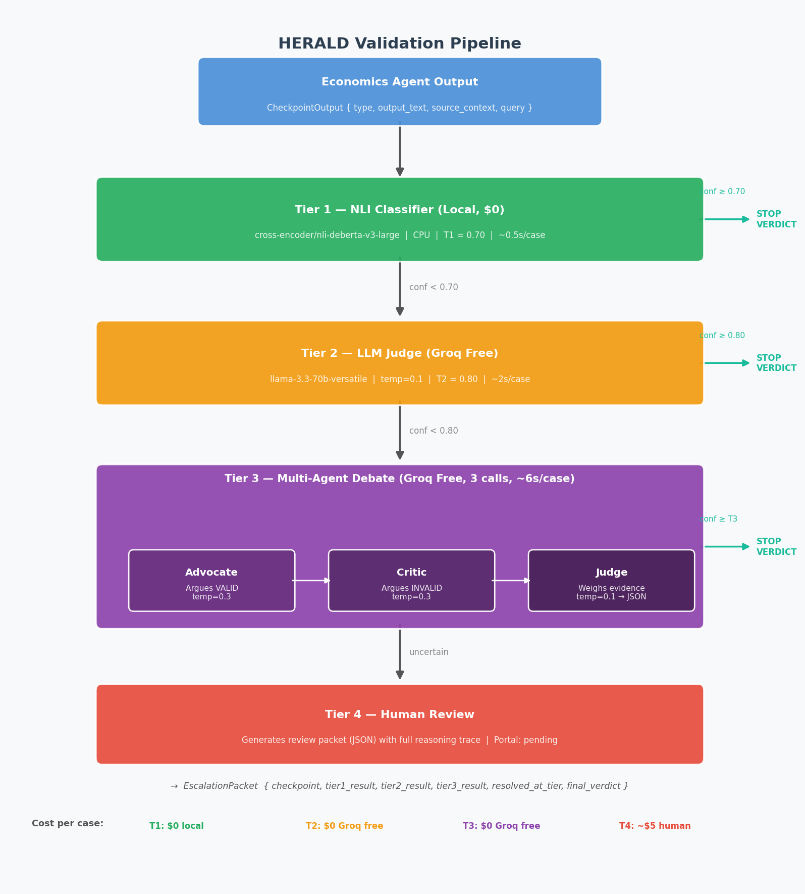
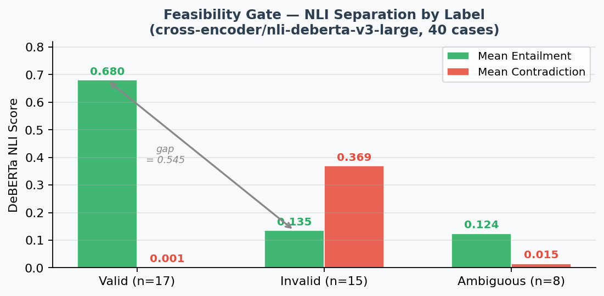

# HERALD — Milestone 2 Progress Report
**Hierarchical Escalating Retrieval and LLM Disagreement Pipeline**
*Data Preparation & Initial Agent Implementation | 2026-03-15*

---

## 1. What HERALD Does

HERALD validates outputs from economics research LLM agents before they enter reports or downstream reasoning. Claims are routed through progressively expensive validators — stopping as soon as any tier is confident — balancing cost, latency, and accuracy.

Five checkpoint types are validated:

| CP | Type | What is checked |
|----|------|----------------|
| 1 | Retrieval | Retrieved document is topically relevant to the query |
| 2 | Claim Extraction | Extracted claim is directly entailed by source; numbers exact |
| 3 | Synthesis | Paragraph faithfully represents all contributing claims |
| 4 | Numerical | Numbers within accepted rounding; direction correct |
| 5 | Causal | Causal language does not overstate source's evidence strength |

Verdicts: **VALID** / **INVALID** / **UNCERTAIN** (→ human review).

---

## 2. System Architecture

The pipeline processes each `CheckpointOutput` through up to four tiers. Every case returns a complete `EscalationPacket` with verdicts, confidence scores, and reasoning from every tier that ran — providing a full audit trail. Thresholds T1=0.70 and T2=0.80 are configurable in `configs/default.yaml`.

---

## 3. Data Pipeline

**Datasets built:**

| Dataset | Cases | Purpose |
|---------|-------|---------|
| `data/test_sets/sample_cases.json` | 10 | Labeled eval set (ground truth) |
| `data/test_sets/feasibility_samples.json` | 40 | Expanded smoke-test / NLI feasibility set |
| `data/weak_labels/unlabeled_pairs.json` | 30 | Unlabeled source/claim pairs |
| `data/weak_labels/weak_labeled.json` | ~40 | Groq-generated weak labels for DeBERTa fine-tuning |

All cases are grounded in U.S. macroeconomics (Fed policy, inflation, housing, labor markets) with three-way labels: `valid / invalid / ambiguous`. Validity criteria for each checkpoint type are precisely defined in `docs/validity_definitions.md` — for example, CP4 (Numerical) allows ±1 unit of rounding ("1.08M" from source "1.078M" is valid; "5% decline" from "3.2%" is not).

**Feasibility gate — NLI separation check (GO/NO-GO):**

Before building the full pipeline, a feasibility check verified that `cross-encoder/nli-deberta-v3-large` produces meaningful signal on economics data without fine-tuning.

The 0.545 entailment gap between valid (0.680) and invalid (0.135) classes confirms that Tier 1 carries real discriminative power. **Gate passed** — fine-tuning repositioned as Phase 2 enhancement, not a prerequisite.

---

## 4. Agent Implementation

### Tier 1 — NLI Classifier
Runs locally on CPU; zero cost. Frames validation as an NLI task: the source context is the *premise*, the agent output is the *hypothesis*. DeBERTa produces three softmax probabilities (entailment / contradiction / neutral); the highest-scoring class becomes the verdict, subject to the T1 confidence threshold.

For multi-source checkpoints (CP1, CP3), three aggregation strategies are supported: `max_entailment` (any chunk supports the claim), `max_contradiction` (any chunk contradicts), and `mean` (balanced). The label map is read dynamically from the model's own config so either DeBERTa variant can be loaded without code changes.

### Tier 2 — LLM Judge
Single Groq call to `llama-3.3-70b-versatile` (free tier, temp=0.1). The judge receives the output text, source context, and Tier 1's raw NLI scores. It must return structured JSON `{ verdict, confidence, reasoning, key_issues }` enforced via Groq's `json_object` response format. If stated confidence is below T2, the verdict is overridden to UNCERTAIN and the case escalates. Three-attempt retry with 2s backoff handles rate limits.

### Tier 3 — Multi-Agent Debate
Three sequential Groq calls per case (~6s total). The **Advocate** builds the strongest case that the output is valid (temp=0.3); the **Critic** argues it is not (temp=0.3); the **Judge** rules on *source evidence* — not rhetorical quality — and returns a structured JSON verdict (temp=0.1). Both advocate and critic receive the full prior analysis (Tier 1 NLI scores + Tier 2 reasoning), so the debate is targeted at exactly the point of disagreement.

The temperature split (0.3 for advocates, 0.1 for judge) was a design change made after testing showed that near-zero temperature produces nearly identical advocate/critic arguments, collapsing the debate into two copies of the same analysis.

### Tier 4 — Human Review
When all automated tiers remain uncertain, the pipeline generates a structured JSON review packet containing the full reasoning trace from all prior tiers, a framed question tailored to the source of uncertainty, and all context a human reviewer needs. Packets are saved to `results/human_review/`. A web portal for verdict submission is the primary remaining gap (see Risks).

---

## 5. Results

**Summary on 10 labeled cases:**

| Metric | Value |
|--------|-------|
| Overall accuracy | **90%** (9/10) |
| Resolved at Tier 1 (NLI only) | 7 cases — 85.7% accuracy |
| Resolved at Tier 2 (LLM judge) | 2 cases — 100% accuracy |
| Resolved at Tier 3 (debate) | 1 case — 100% accuracy |
| Human review required | 0 cases |
| Total cost | **$0.00** |

**Escalation profile and error analysis (40-case run):**

Numerical (CP4) cases are resolved most efficiently — 71% at Tier 1 alone. Synthesis and causal cases consistently require Tier 2 or Tier 3: interpretive framing falls outside what NLI can confidently assess, which confirms Tier 3 debate is a first-class path for those types, not an exception.

The single misclassification is the ambiguous test case — a reasonable inference from source that the system classified as valid at 0.832 NLI confidence. HERALD never outputs UNCERTAIN on this 10-case set, meaning the ambiguous case is effectively a Tier 1 confident mis-verdict rather than a correctly-escalated case. This is the expected failure mode and drives the risk mitigation below.

---

## 6. Architecture Updates from Early Learnings

**Learning 1 — Base DeBERTa is strong enough to defer fine-tuning.**
The feasibility gate showed a 0.545 entailment gap without any domain adaptation. Fine-tuning (`notebooks/finetune_tier1.py` is ready) is now a Phase 2 improvement once 500+ weak-labeled pairs exist, not a Phase 1 prerequisite. This unblocked the pipeline 2–3 weeks early.

**Learning 2 — Synthesis and causal checkpoints need a dedicated high-confidence path.**
These types have structurally higher NLI uncertainty due to interpretive framing. The escalation profile plot confirms that 50–57% of CP3/CP5 cases route through Tier 2 or Tier 3, compared to 29% for numerical. Tier 3 is now designed as the *expected* resolution path for these types, not a rare fallback.

**Learning 3 — Debate quality requires temperature differentiation.**
Running all Tier 3 agents at temp=0.1 produces near-identical advocate/critic arguments. Setting advocate/critic to temp=0.3 while keeping the judge at temp=0.1 produces meaningfully opposed arguments and a more reliable judge verdict.

---

## 7. Risks and Mitigation Plans

**Risk 1 — Groq rate limits interrupt multi-case runs**
*Severity: High.* Two of four deliverable plots could not complete in a single session due to 429 errors during the baseline comparison run. Retry logic (3 attempts, 2s backoff) is already in place. Additional mitigations: result caching by `(checkpoint_hash, tier)`, configurable inter-request delay for bulk runs, Groq paid tier as fallback for final evaluation (~$5 for 40-case sweep).

**Risk 2 — DeBERTa confidence miscalibrated for ambiguous cases**
*Severity: High.* The ambiguous test case resolved at Tier 1 with 0.832 confidence — above the T1 threshold — rather than correctly escalating to human review. At scale, ambiguous cases will generate similar mis-verdicts with high stated confidence. Mitigation: use `notebooks/calibration_analysis.py` to compute ECE and identify systematic overconfidence; consider checkpoint-type-specific thresholds (lower T1 for CP3/CP5) to force more borderline cases through higher tiers.

**Risk 3 — No Tier 4 review portal**
*Severity: Medium.* The current 0% human review rate reflects a mostly clear-cut test set. Synthesis and causal cases in production will likely require human review at meaningful rates. Packet generation and save are complete; a minimal Streamlit or Flask form for verdict submission is the next build priority to close the Tier 4 feedback loop.

**Risk 4 — Weak label quality contaminates fine-tuning**
*Severity: Medium.* LLM-generated labels may be systematically wrong for subtle causal overstatement patterns. Mitigation: filter to confidence ≥ 0.85 before training (already designed into `generate_weak_labels.py`); A/B evaluate fine-tuned vs. base model on the hand-labeled 10-case set before deploying.

---

## 8. What Is Done vs. Remaining

**Complete:** full 4-tier pipeline, all three automated agents functional, 50 labeled/expanded cases, weak label generation, feasibility gate, evaluation framework, threshold sweep, baseline comparison, calibration analysis, phase gates, demo agent.

**Remaining:** DeBERTa fine-tuning (script ready, needs 500+ pairs), Tier 4 review portal UI, 2 of 4 deliverable plots (blocked by rate limits), integration tests.

---

*Branch: manav-dev | Commit: b35bf2d*
